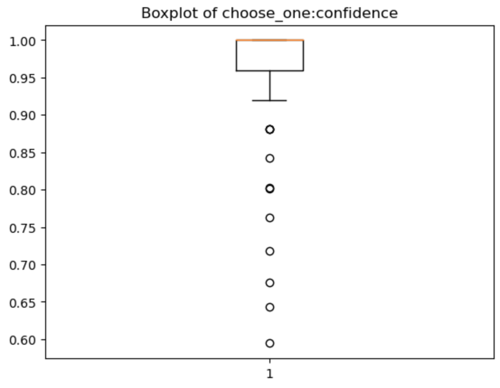

# IT3212 - Assignment 1

**Group members:** Haakon Tideman Kanter, Henrik Skog, Mattis Hembre, Max Gunhamn, Sebastian Sole, Magnus Rødseth.

## Table of Contents

> TODO: Generate the table of contents later.

## Selecting the dataset

...

## Defining the problem statement

...

### The real-world problem to solve

...

### The machine learning problem to solve

...

## Sources of noise

...

## Preprocessing the data

### Detecting and removing outliers

Regarding the detection and subsequent removal of outliers in the dataset, we can create a boxplot of the `choose_one:confidence` column. By inspecting this boxplot, we can see that the minimum confidence that is not considered an outlier is at 0.92 confidence, whilst the corresponding maximum confidence is at 1.0 confidence. The median value is 1. This indicates that half of the values in the `choose_one:confidence` column are at 1, and the other half are below 1. Given the nature of confidence scores, this likely indicates that many of the judgments are made with full confidence. The many small dots from 0.60 up to 0.90 represent the outliers in our dataset. These are individual observations that fall far from the rest of the data, below the minimum value. The presence of many dots suggests that there are several data points with confidence levels significantly lower than the majority of the dataset.

However, by inspecting the `text` column of rows with `choose_one:confidence` below 1.0, we observe that the tweets still concern real disasters. Therefore, only removing the outliers in the `choose_one:confidence` column would not be a good idea, as we would lose a lot of data.

## Potential solutions

### Solution 1

...

### Solution 2

...

## Individual contributions

...

## Personalized feedback form

### Feedback options

...
