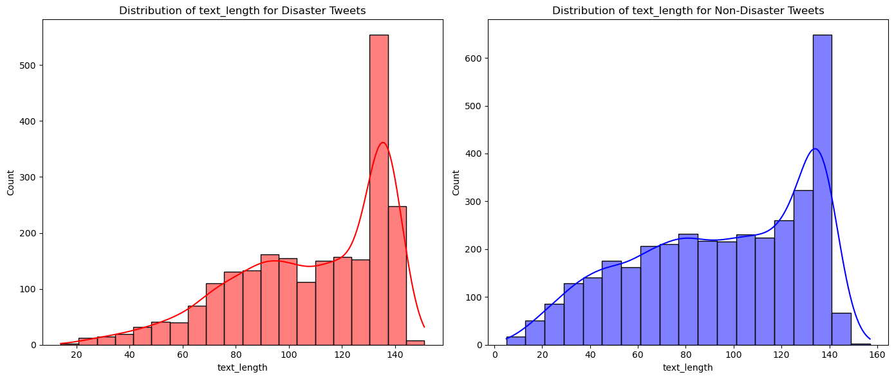
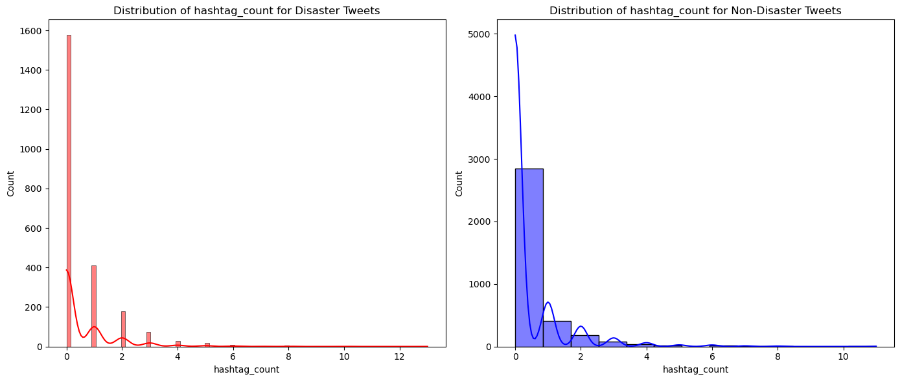
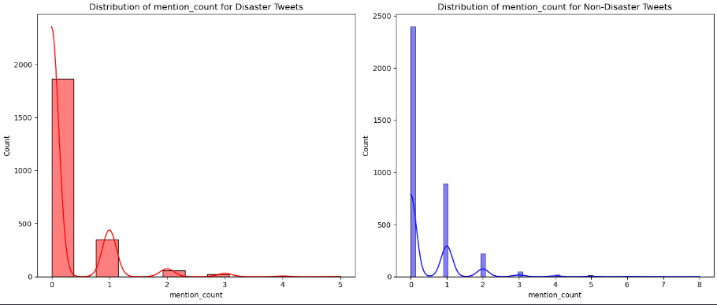
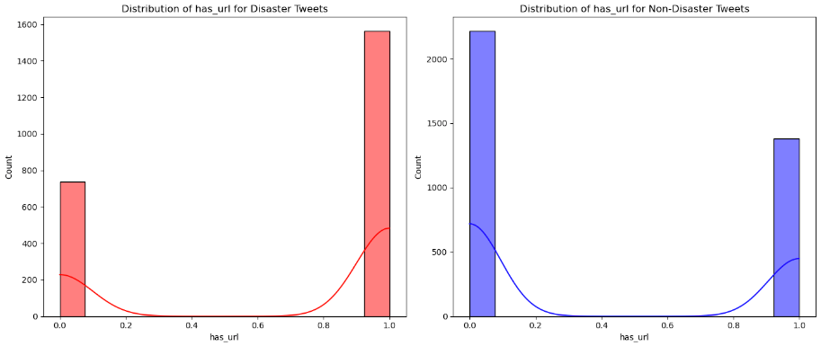
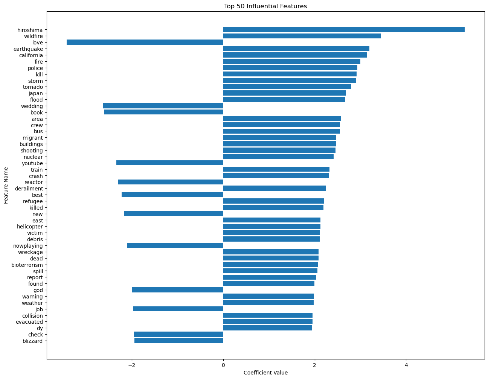

# IT3212 - Assignment 2

Written and developed by Haakon Tideman Kanter, Henrik Skog, Mattis Czternasty Hembre, Max Gunhamn, Sebastian Sole, and Magnus Rødseth. 

## 1. Implement the preprocessing

We started by removing features, according to what was outlined in assignment 1. Additionally, we removed the `location` feature to preserve the privacy of the users and because it is not particularly relevant to determing whether a tweet is related to a disaster. Next, we removed rows with a confidence threshold below `1.0`.

Next, we preprocessed the textual data. We cleaned up the `keyword` column, ensuring that all keywords were lower case, and that all keywords were separated by a single space. For comparison, some keywords were on the format `airplane%20accident`, which should be `airplane accident`.

Furthermore, we cleaned the `text` column. The first part of this included removing links, line breaks, extra spaces, special characters and punctuation. Next, we removed English stopwords. Finally, we lemmatized the text.

When handling categorical data, we removeds rows with a `choose_one` value of `Can't decide`, according to what was outlined in assignment 1. Next, we mapped the `choose_one` values `Relevant` and `Not Relevant` to `1` and `0`, respectively. This was stored in a new feature, called `target`.

Moreover, we removed duplicated rows with regards to the `text` column, as outlined in assignment 1.

## 2. Extract features

### 2.1 Text feature
Machine learning models are not able to understand raw text, so the text must be converted into a numerical representation. In this delivery we have chosen to do this this by using tf-idf vectorization. 

TD-IDF, or term frequency–inverse document frequency, is an extenstion of the bag-of-words model. The bag-of-words algorithm represents a document by the occurrence of words within a it. You first build a vocabulary by looking at the set of all words used in the corpus. The amount of words in the vocabulary maps directly to the number of features it produces for a given document. The result of embedding a document with bag-of-words is simply a one hot encoding of the ocurrences of the words in the vocabulary in the document.

TF-IDF extends the bag-of-words model by also including how important a word is in the context of the entire corpus. The importance of a word increases proportionally to the number of times a word appears in the document, but is offset by the frequency of the word in the corpus. This means that words that appear frequently in a single document but not in many documents throughout the corpus will get a high score. On the other hand, common words that appear frequently in many documents (like "and", "the", etc.) will get a low score. This normalization process ensures that less emphasis is placed on common words that do not carry much meaningful information.

The implementation is done using the `TfidfVectorizer` from `sklearn.feature_extraction.text`. The `TfidfVectorizer` converts a collection of raw documents to a matrix of TF-IDF features. The `TfidfVectorizer` is equivalent to using `CountVectorizer` followed by `TfidfTransformer`. Using the `TfidfVectorizer` is more efficient and requires less code.

However, by converting the text into a numerical representation, we lose a lot of information. For example, the order of the words is lost. TF-IDF is also not able to capture the semantic meaning of the words.  To combat this, we try to extract some additional features from the text. 

### 2.1. Text length

### 2.1. Counting hashtags

Hashtag counts were extracted, as we suspected tweets related to a disaster might contain more hashtags than a tweet which does not. 
```py
# Extract the number of hashtags
df['hashtag_count'] = df['text'].apply(lambda x: len([c for c in str(x) if c == '#']))
```

### 2.2. Counting mentions

The `mention_count` is a feature where we see how many mentions there are in a tweet. This means how many other twitter users are mentioned in the tweet.
This was extracted because we thought there might be a connection betweeen how many users were tagged and if the tweets are disaster-related. The group thought that disaster-related tweets would have more mentions than tweets that were not disaster related.


```py
# Extract the number of mentions
df['mention_count'] = df['text'].apply(lambda x: len([c for c in str(x) if c == '@']))
```

### 2.3. Checking if the tweet contains a url

The `has_url` feature was extracted because tweets related to a disaster might point to an online resource where one can find more information about the situation. The column is `1` if the tweet contains a url and `0` if not. The `has_url` feature had to be done before preprocessing, as we remove links in the preprocessing step.


```py
# Extract the `has_url` feature
df['has_url'] = df['text'].apply(lambda x: 1 if 'http' in str(x) else 0)
```

### 2.4. N-grams

N-grams was a feature we wanted to look at, as we suspected there could be a correlation between bi- or trigrams and whether the tweet was related to a disaster or not. This is because bigrams and trigrams carry more context than than single words. We found the most used bigrams and trigrams, both for disaster-related tweets and non-disaster related tweets.

```py
from nltk.util import ngrams
from nltk.tokenize import word_tokenize


def create_ngrams(text, n):
    tokens = word_tokenize(text)
    n_grams = list(ngrams(tokens, n))
    return n_grams


df['bigrams'] = df['cleaned_text'].apply(lambda x: create_ngrams(x, 2))
df['trigrams'] = df['cleaned_text'].apply(lambda x: create_ngrams(x, 3))
```

We also inspected the most common bigrams and trigrams in disaster-related tweets and non-disaster related tweets:

```py
from collections import Counter


disaster_bigrams = df[df['target'] == 1]['bigrams']
non_disaster_bigrams = df[df['target'] == 0]['bigrams']

disaster_bigram_counts = Counter([gram for ngram_list in disaster_bigrams for gram in ngram_list])
non_disaster_bigram_counts = Counter([gram for ngram_list in non_disaster_bigrams for gram in ngram_list])


print("Most common n-grams in disaster-related tweets:")
print(disaster_bigram_counts.most_common(10))


print("\nMost common n-grams in non-disaster tweets:")
print(non_disaster_bigram_counts.most_common(10))
```

Result for bigrams:

```py
Most common n-grams in disaster-related tweets:
[(('suicide', 'bomber'), 78), (('northern', 'california'), 53), (('california', 'wildfire'), 44), (('home', 'razed'), 37), (('suicide', 'bombing'), 36), (('oil', 'spill'), 36), (('latest', 'home'), 36), (('razed', 'northern'), 36), (('severe', 'thunderstorm'), 35), (('70', 'year'), 34)]

Most common n-grams in non-disaster tweets:
[(('i', 'am'), 173), (('do', 'not'), 89), (('can', 'not'), 51), (('you', 'are'), 50), (('youtube', 'video'), 33), (('liked', 'youtube'), 32), (('i', 'have'), 26), (('cross', 'body'), 26), (('body', 'bag'), 26), (('going', 'to'), 25)]
```

Did the same for trigrams

```py

disaster_trigrams = df[df['target'] == 1]['trigrams']
non_disaster_trigrams = df[df['target'] == 0]['trigrams']


disaster_trigram_counts = Counter([gram for ngram_list in disaster_trigrams for gram in ngram_list])
non_disaster_trigram_counts = Counter([gram for ngram_list in non_disaster_trigrams for gram in ngram_list])


print("Most common trigrams in disaster-related tweets:")
print(disaster_trigram_counts.most_common(10))


print("\nMost common trigrams in non-disaster tweets:")
print(non_disaster_trigram_counts.most_common(10))
```

Result for trigrams:

```py
Most common trigrams in disaster-related tweets:
[(('northern', 'california', 'wildfire'), 38), (('latest', 'home', 'razed'), 36), (('home', 'razed', 'northern'), 36), (('razed', 'northern', 'california'), 35), (('watch', 'airport', 'get'), 34), (('airport', 'get', 'swallowed'), 34), (('get', 'swallowed', 'sandstorm'), 34), (('swallowed', 'sandstorm', 'minute'), 34), (('suicide', 'bomber', 'detonated'), 34), (('pkk', 'suicide', 'bomber'), 32)]

Most common trigrams in non-disaster tweets:
[(('liked', 'youtube', 'video'), 32), (('i', 'am', 'going'), 18), (('pick', 'fan', 'army'), 18), (('cross', 'body', 'bag'), 17), (('reddits', 'new', 'content'), 11), (('new', 'content', 'policy'), 11), (('low', 'selfimage', 'take'), 10), (('selfimage', 'take', 'quiz'), 10), (('deluged', 'invoice', 'make'), 10), (('likely', 'rise', 'top'), 10)]
```

### 2.5. Sentiment analysis

We implemented sentiment analysis to investigate if the sentiment of the tweet would be relevant to classifying the tweet as disaster-related or not. We did this using the `SentimentIntensityAnalyzer` from `nltk`:

```py
def analyze_sentiment_vader(text):
    analyzer = SentimentIntensityAnalyzer()
    sentiment_scores = analyzer.polarity_scores(text)
    return sentiment_scores['compound']

df['sentiment'] = df['text'].apply(analyze_sentiment_vader)
df_test['sentiment'] = df_test['text'].apply(analyze_sentiment_vader)

df.sentiment.head()

```

Based on the code below, it seemed like it was a significant difference in the sentiment between the disaster-related and not disaster-related tweets. We then looked at the counts for each sentiment, and saw there was a distribution imbalance where the majority of disaster-related tweets had a negative sentiment, whilst there was way more positive sentiment amongst the "non-disaster-related" tweets. 

We also tested with "text" instead of "cleaned_text" and the results were still the same (significant difference).


```py

from scipy import stats

disaster_group = df[df['target'] == 1]['sentiment']
not_disaster_group = df[df['target'] == 0]['sentiment']

t_statistic, p_value = stats.ttest_ind(disaster_group, not_disaster_group, equal_var=False)

print(p_value)
if p_value < 0.05:
    print("There is a significant difference in sentiment between disaster and not disaster tweets.")
else:
    print("There is no significant difference in sentiment between disaster and not disaster tweets.")
```

## 3. Select features

These are the raw features we have extracted that the model is able to use out of the box that we have to choose from:

| Feature        | Description                                |
|----------------|--------------------------------------------|
| keyword        | Specific keyword associated with the text. |
| text_length    | The length of the text in characters.      |
| hashtag_count  | Number of hashtags used in the text.       |
| mention_count  | Number of mentions (@) in the text.        |
| has_url        | Boolean indicating if the text has a URL.  |
| sentiment      | Sentiment value of the text.               |

**Length of the text**: **not selected**

We see that the distribution of the text-length is fairly similar for both disaster and non-disaster tweets. The difference may be significant, but it is not very large. Thus, we decided not to use this feature in our model.

**How many hashtags used in the text: not selected**

The hashtag count also has a similar distribution for both disaster and non-disaster tweets. The difference is not very large, so we decided not to use this feature.

**How many mentions (@) in the text: not selected**

The mention count has a similar distribution for both disaster and non-disaster tweets. The difference is not very large, so we decided not to use this feature.

**If the tweet contains a url: selected**

The url count has quite a large difference between disaster and non-disaster tweets. We can see that the majority of disaster-related tweets contain a url, whilst the majority of non-disaster tweets do not contain a url. This is of course not enough to conclude that the tweet is disaster-related, but it might be a useful feature.

**Sentiment analysis: selected**
We computed the t-statistic and p-value by performing an independent two-sample t-test on the sentiment scores of tweets categorized as disaster-related and those that are not. The sentiment scores were calculated using VADER sentiment analysis, where higher values denote more positive sentiment and lower values denote more negative sentiment. The t-statistic indicates the magnitude and direction of the difference in mean sentiment scores between the two groups, while the p-value quantifies the evidence against the hypothesis that the groups have the same mean sentiment.

The results of the t-test was -21.96539979122823:
The t-statistic measures the size of the difference relative to the variation in the data. A larger absolute value of the t-statistic means that the difference is more significant.

Since it's negative, this indicates that the mean sentiment score of the disaster_group is lower than the mean sentiment score of the not_disaster_group.

The p-value was 3.520081770393815e-102:
The p-value is extremely small, specifically 3.52 x 10^-102. In general terms, when the p-value is near 0, it suggests that the observed data is very unlikely under the null hypothesis. The null hypothesis for this t-test is that the mean sentiment scores of the disaster and non-disaster tweets are the same.

A very small p-value, especially one as tiny as this, provides strong evidence against the null hypothesis, leading us to reject it. In other words, it indicates a statistically significant difference in sentiment scores between the two groups.

Given this result, we conclude that there is a statistically significant difference in sentiment scores between disaster tweets and non-disaster tweets.
The negative t-statistic suggests that, on average, disaster tweets have lower sentiment scores compared to non-disaster tweets, which makes sense given the nature of the tweets. 

From this we can conclude that the sentiment feature is useful, so we use it in our model.

**N-grams**
We include the n-grams in our analysis since they include additional semantic infomation about the text which would otherwise be lost when using tf-idf. We use the n-grams as features in our model.

## 4. Modelling
When evaluating the performance of our models, we want to ensure that they are both accurate and generalizable. Accuracy refers to how well the model performs on the training data. Generalizability refers to how well the model performs on unseen data. A model that is accurate but not generalizable is overfitting to the training data, while a model that is neither accurate nor generalizable is underfitting. To account for this, the first thing we did was to split the data into a training set and a test set. We used 80% of the data for training and 20% for testing. Both the training and test sets were preprocessed in the same way. However, no rows were removed from the test set during preprocessing as this would skew the results. We also made sure to fit the TF-IDF vectorizers on the training set only, to avoid data leakage.

We trained the models on the training set using 5-fold cross-validation. The reason for using cross-validation is to ensure that the model is evaluated on different subsets of the training data. This helps reduce the risk of overfitting. The reason for using 5 folds is that it is a good balance between computational cost and accuracy. We then used the trained model to predict the labels for the test set. This way we ensure that the model is evaluated on unseen data, giving us a better idea of how well it would perform in the real world.  However, it should still be said that the test set is not a perfect representation of the real world. The test set is still a subset of the same dataset, and the data is not collected in real-time. This means that the test set is not a perfect representation of the real world. 

To tune our models we use grid search. Grid search is a technique for finding the optimal combination of hyperparameters for a given model. The reason for using grid search is that it is a simple and effective way of testing which parameters make the model perform the best. The downside of grid search is that it is computationally expensive. However, since we are only tuning a few hyperparameters, the computational cost is not too high.

## 4.1 Logistic regression
### 4.1.1 About the model
The first basic modelling method used was logistic regression. Logistic regression was chosen due to the following reasons:

**Binary Classification:** Logistic Regression models probability of output in terms of input, so by introducing a threshold value it can be used as a classifier which fits our binary classification problem.

**Simplicity and Interpretability:** Logistic Regression is a relatively simple algorithm, both conceptually and in terms of implementation. It's a good starting point because its results serve as a benchmark for more complex models. Furthermore, the coefficients in a logistic regression model can offer insights into the importance and impact of each feature (in this case, TF-IDF weighted terms) on the outcome. This can help in understanding which terms or words are more indicative of a tweet being connected to an accident, thus also helping us understand the problem better before moving on to more complex models.

**Baseline Model:** This is just the beginning of the project. Starting with a simpler model like Logistic Regression allows us to establish a baseline performance. Once we have this baseline, you can then explore more complex models and techniques, ensuring that any added complexity genuinely results in better performance. It’s a principle of model development to start simple and then add complexity as needed.

**Proven Track Record:** Logistic Regression is a classic. Its longstanding reputation in the domain ensures that it's a tried-and-tested method to begin with.

### 4.1.2 Hyperparameters
These are the hyperparameters we tuned for logistic regression:

- `C`: Varying levels of regularization (default = 1.0)

### 4.1.3 Modelling results

#### 4.1.3.1 Stock model (no tuning)

**Validation result (5-fold cross-validation):**
| Label | Precision | Recall | F1-Score |
|-------|-----------|--------|----------|
| 0     | 0.86      | 0.90   | 0.88     |
| 1     | 0.84      | 0.76   | 0.80     |

Overall accuracy: 0.85


**Test result**
| Label | Precision | Recall | F1-Score |
|-------|-----------|--------|----------|
| 0     | 0.78      | 0.87   | 0.82     |
| 1     | 0.81      | 0.69   | 0.75     |

Overall accuracy: 0.79

#### 4.1.3.2 Results after hyperparameter tuning

We got the best results with the following hyperparameters:

- `C`: 2.0

**Validation result (5-fold cross-validation):**

| Label | Precision | Recall | F1-Score | Support |
|-------|-----------|--------|----------|---------|
| 0     | 0.90      | 0.94   | 0.92     | 3595    |
| 1     | 0.91      | 0.84   | 0.87     | 2300    |

Overall Train Accuracy: 0.9028

Confusion Matrix for Training:  
[[3393, 202],  
[371, 1929]]

**Test result**

| Label | Precision | Recall | F1-Score | Support |
|-------|-----------|--------|----------|---------|
| 0     | 0.79      | 0.87   | 0.83     | 1219    |
| 1     | 0.81      | 0.71   | 0.75     | 957     |

Overall Test Accuracy: 0.7955

Confusion Matrix for Testing:  
| Actual \ Predicted | Predicted 0 | Predicted 1 |
|--------------------|-------------|-------------|
| Actual 0           | 1056        | 163         |
| Actual 1           | 282         | 675         |

This plot shows the top 50 features that have the highest coefficients from the trained model. The words hiroshima, wildfire, eartquake, california, fire and police has the highest influence in favor of an accident, while the words love, wedding and book are weighted as the most influential features for non-accident tweets.


## 4.2. Support Vector Machine (SVM)

### 4.2.1 About the model
The second basic modelling method used was a support vector machine (SVM). SVM were chosen due to the following reasons:

- **High Dimensionality**. Text data, when transformed into a numerical format like TF-IDF or Count Vectorization, often results in a high-dimensional feature space, as each unique word or token becomes a dimension. SVMs are designed to handle high-dimensional data effectively.

- **Effective in Non-linear Problems**. While the basic SVM is a linear classifier, by applying the kernel trick, SVMs can solve non-linear classification problems. This means that if the boundary between 'Relevant' and 'Not Relevant' is not linear in the feature space, SVM can still find an optimal boundary.

- **Clear margin of separation**. SVMs aim to find the hyperplane that has the maximum margin between two classes. This often results in better generalization to unseen data, reducing the risk of overfitting.

### 4.2.2 Hyperparameters

- **Regularization (`C`)**. The hyperparameter `C` is the inverse of regularization strength. Smaller values of `C` indicate stronger regularization, which can prevent overfitting, but might also lead to underfitting if too strong. On the other hand, larger values of `C` mean weaker regularization, which might fit the training data more closely but risk overfitting. By tuning `C`, we aim to strike the right balance between underfitting and overfitting.

- **Penalty (`penalty`)**. The `penalty` parameter specifies the type of regularization to be applied. The most common types are L1 and L2 regularization. L1 regularization can lead to some coefficients becoming exactly zero, effectively selecting a simpler model with fewer features. On the other hands, L2 regularization tends to shrink coefficients but not set them to zero. The choice between L1 and L2 can impact the model's performance and interpretability.

- **Solver (`solver`)**. The `solver` parameter dictates the optimization algorithm to be used. Different solvers might converge at different rates and can have varying levels of accuracy, depending on the nature of the data and the problem. Some solvers work better with certain penalty types, making it important to consider the combination of `solver` and `penalty` when tuning the model.

For the SVM, the regularization parameter `C` was adjusted to analyze the decision boundary. We explored different types of kernels using the `kernel` parameter, including `linear` and `rbf`. The coefficient for the kernel function, `gamma`, was also tuned, toggling between `scale` and `auto`. The grid search cross-validated the model's performance for each combination.

The accuracy obtained after hyperparameter tuning (approximately 91.63%) is **slightly higher** than the accuracy from the initial SVM model, which was around 91.43%. In particular, it was the change of `kernel` parameter: from `linear` to `rbf`. The hyperparameter tuning process for SVM managed to find a set of parameters that improved the model's accuracy slightly. This highlights the importance of such tuning processes.

- **Regularization (`C`)**. Like in Logistic Regression, the `C` parameter in SVM controls the trade-off between obtaining a wider margin and classifying the training points correctly. A smaller `C` creates a wider margin, which might misclassify more points, while a larger `C` results in a narrower margin, making the model fit more closely to the training data. Adjusting `C` helps balance between overfitting (high variance) and underfitting (high bias).

- **Kernel (`kernel`)**. The kernel trick allows SVM to create non-linear decision boundaries. The choice of kernel can significantly impact the model's performance. The `rbf` (Radial Basis Function) kernel, on the other hand, can create more complex, non-linear boundaries.

- **Kernel Coefficient (`gamma`)**. Adjusting `gamma` can help control the shape and complexity of the decision boundary, impacting the model's generalization capability.

### 4.2.3 Modelling results

> TODO: skrive
#### Stock model (no tuning)
#### Results after hyperparameter tuning

## 5. Comparing modelling methods

> TODO: Write a paragraph about the comparison of the modelling methods.

### 5.1. Selecting  two performance metrics and comparing modelling methods

- accuracy
  
Used accuracy as a general metric to determine how precise our model was. 

- f1 scores

We chose to look at f1-scores as f1-scores incorporates both precision and recall. 

(Lim inn bilder)
...

### 5.2. Why they perform similar

SVM and logistic regression exhibit similar performance for several reasons. These algorithms are considered relatively simple when compared to more complex machine learning techniques. They do not inherently capture complex, nonlinear relationships between features, in contrast to neural networks, which are designed to model intricate feature interactions. As a result, their similarities in performance can be attributed to their linear nature and a focus on individual feature contributions.


...

## 6. Designing a pipeline

The advanced modelling technique we have chosen are Word2Vec embeddings coupled with a Random Forest classifier. 

### Word2Vec
Word2vec is a technique for natural language processing from 2013. The word2vec algorithm uses a shallow neural network model to learn word associations from a large corpus of text. Once trained, it can detect synonymous words or suggest additional words for a partial sentence. In the same way as tf-idf (our current approach), word2vec represents each document with a vector. The vectors are chosen such that they capture the semantic and syntactic qualities of the words.

We will use the library `gensim` to train a Word2Vec model on a large corpus of text. Then, we will use the pre-trained model to generate embeddings for each tweet in our dataset. The embeddings will be used as features in our Random Forest classifier.

There exists many similar models to Word2Vec, such as Glove, FastText, Universal Sentence Encoder and BERT by Google. We chose Word2Vec because it is simple compared to the alternatives, and it is still a big step up from tf-idf.

### Random Forest Classifier
The Random Forest classifier is an ensemble learning method. It is an ensemble of decision trees, where each tree is trained on a random subset of the training data. The final prediction is made by aggregating the predictions of all the trees. Random Forests are robust to overfitting and can handle high-dimensional data effectively.

These are two important techniques the algorithm uses:

Bagging (Bootstrap Aggregating): For each tree, a random sample of the data is drawn with replacement, creating diverse sets of training data. This process introduces variability among the trees, ensuring individual trees are trained on slightly different versions of the data.
Feature Randomness: During tree construction, instead of considering all features for a split, a random subset of features is chosen. This adds another layer of randomness and reduces the correlation between individual trees.

Similarly to the reason we chose Word2Vec, we chose Random Forest because it is a simple and intuitive approach compared to other ensemble methods like XGBoost,  or neural networks.

### Side note about transformer models
We heavily considered using BERT for the whole pipeline. This would probably result in very good scores using BERTs transfer learning structure. However, we found the transformer architecture and attention mechanism very complex to understand. Although it is easy to implement a solution applying a small BERT model in code, we would not be able to understand how it works. 

Another approach is to use a LLM like gpt-3. This would result in even better scores, but the same problem as with BERT applies. We would not be able to understand how it works. Using a LLM would also be very expensive in terms of computational power, and may be overkill for this task.

### Pipeline Design

**Importing Data:**

Similar to the previous pipeline, we start by importing the necessary data.

**Preprocessing the Data:**

We clean the tweets like the current pipeline.

**Feature extraction using Word2Vec:**

Instead of using tf-idf vectorization, we use Word2Vec to generate word embeddings for each tweet.  We will first pre-trained a Word2Vec model on a large document corpus using the `gensim`-library. Then, we will use the pre-trained model to generate embeddings for each tweet in our dataset.

**Modelling using a Random Forest Classifier:**

Train a Random Forest classifier on the Word2Vec embeddings from the training set. 

**Evaluation:**
Use the trained Random Forest model to classify tweets in the test set. Evaluate the model's performance using F1-score. Fine-tune the hyperparameters of the classifier using grid search to achieve the best possible performance.


## 7. Individual contributions
Henrik Skog: Plotting, preprocessing, feature extraction, modelling, pipeline design, report writing

...

## 8. Personalized feedback form

1. Feature extraction: (YES/NO)
2. Feature selection: (YES/NO)
3. Choice of basic modelling methods: (YES/NO)
4. Choice of performance metrics: (YES/NO)
5. Comparison of modelling methods: (YES/NO)
6. Advanced Pipeline Design: (YES/NO)

### 8.1. Other questions

> TODO: Add other quesions if they arise

## 9
